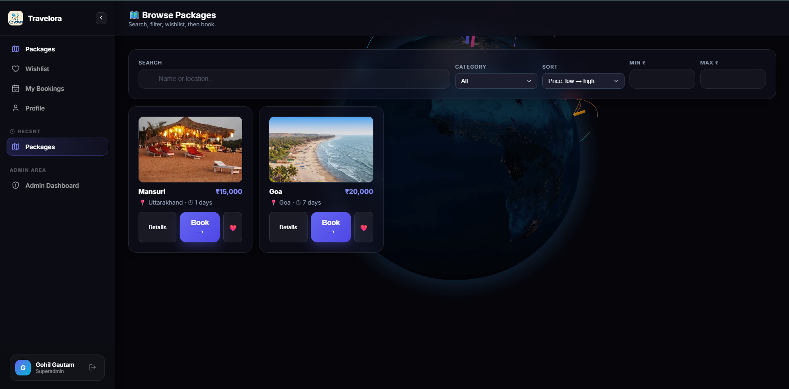
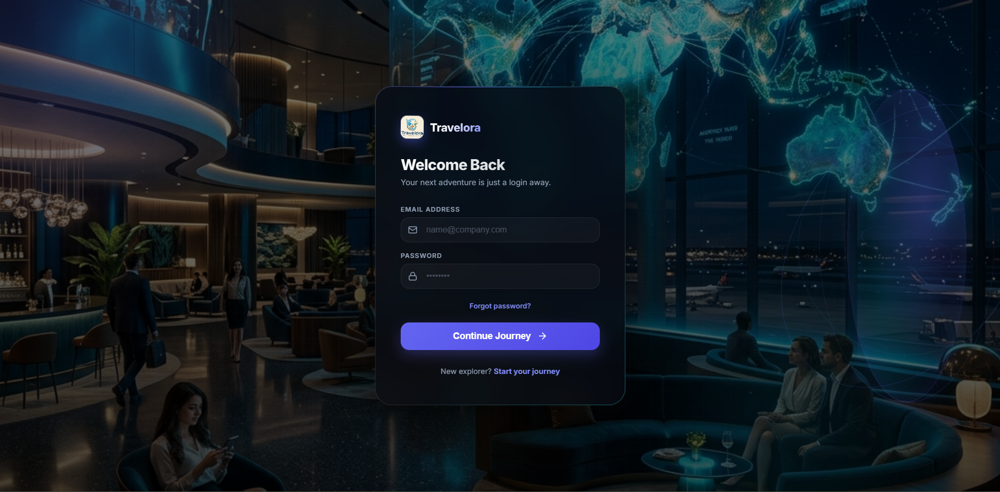
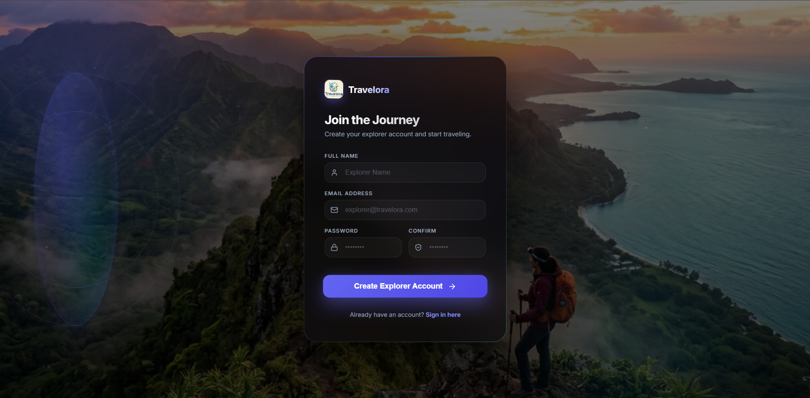
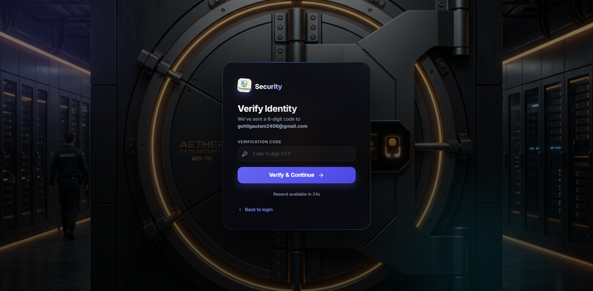
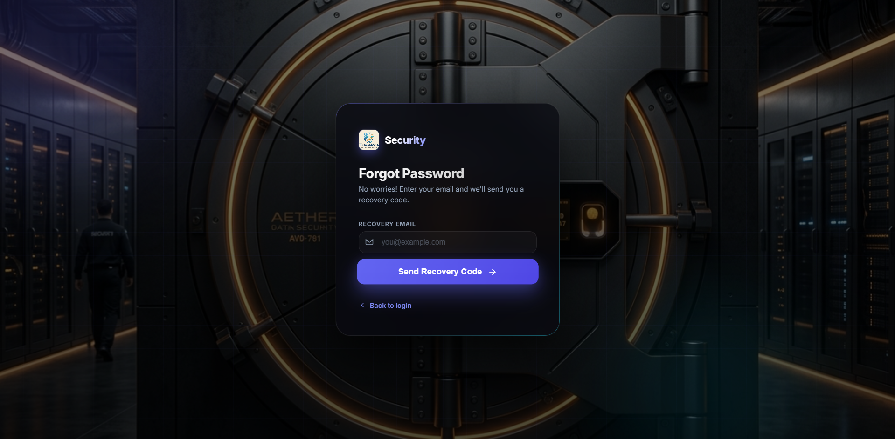
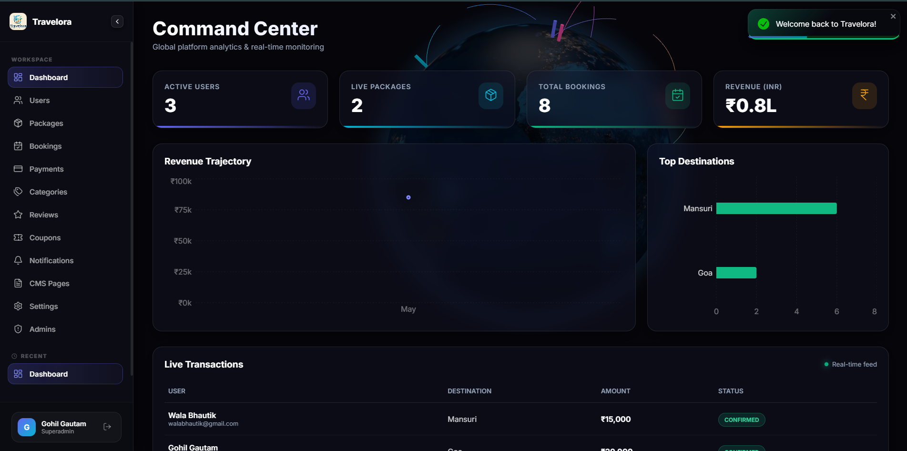
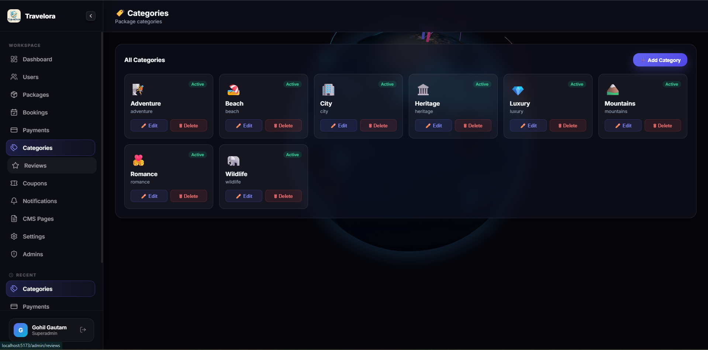
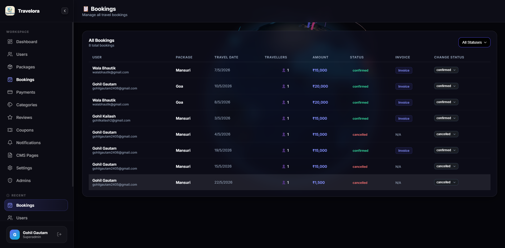
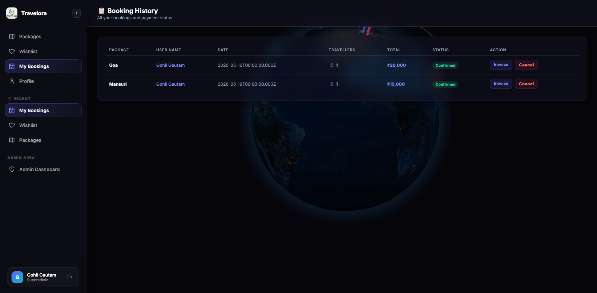
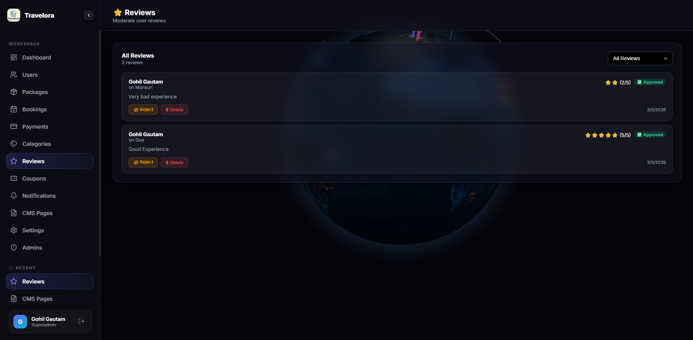

<h1 align="center">🌍 Travelora — Premium Travel Booking Platform</h1>

<p align="center">
  
</p>

<p align="center">
  
  
  
  
  
</p>

<p align="center">
  A state-of-the-art, full-stack travel booking web application with a premium
  <strong>"Galactic Glass"</strong> UI, interactive 3D globe exploration,
  secure Razorpay payments, and a comprehensive admin dashboard.
</p>

---

## 📋 Table of Contents

- [✨ Features](#-features)
- [📸 Screenshots](#-screenshots)
- [🛠️ Tech Stack](#️-tech-stack)
- [🚀 Getting Started](#-getting-started)
- [📁 Project Structure](#-project-structure)
- [🌐 Environment Variables](#-environment-variables)
- [📄 License](#-license)

---

## ✨ Features

| Feature | Description |
|---|---|
| 🌐 **3D Globe** | Interactive world map powered by Three.js & React Globe.gl for destination discovery |
| 🔐 **Auth Suite** | Login, Signup, OTP Verification, Forgot & Reset Password with animated "Galactic Glass" UI |
| 💳 **Razorpay Payments** | End-to-end secure checkout and payment confirmation flow |
| 📊 **Admin Dashboard** | Full-control panel — manage packages, users, bookings, and real-time analytics |
| 👤 **User Dashboard** | Personalized booking history, reviews, and account management |
| 📦 **Package Catalog** | Category-based browsing with rich detail pages |
| 📝 **Reviews** | Post-trip rating and review system |
| 📧 **Email Notifications** | Automated booking confirmations, OTP emails via Nodemailer |
| 📄 **PDF Invoices** | Auto-generated booking invoices using PDFKit |
| ☁️ **Cloud Media** | Image upload & optimization via Cloudinary |
| 📱 **Fully Responsive** | Pixel-perfect on desktop, tablet, and mobile |

---

## 📸 Screenshots

### 🔑 Authentication

<table>
  <tr>
    <td align="center"><strong>Login Page</strong></td>
    <td align="center"><strong>Sign Up Page</strong></td>
  </tr>
  <tr>
    <td></td>
    <td></td>
  </tr>
  <tr>
    <td align="center"><strong>OTP Verification</strong></td>
    <td align="center"><strong>Forgot Password</strong></td>
  </tr>
  <tr>
    <td></td>
    <td></td>
  </tr>
</table>

---

### 📊 Dashboards

<table>
  <tr>
    <td align="center"><strong>Admin Dashboard</strong></td>
    <td align="center"><strong>User Dashboard</strong></td>
  </tr>
  <tr>
    <td></td>
    <td></td>
  </tr>
</table>

---

### 🗺️ Booking & Packages

<table>
  <tr>
    <td align="center"><strong>Browse Categories</strong></td>
    <td align="center"><strong>Booking Page</strong></td>
  </tr>
  <tr>
    <td></td>
    <td></td>
  </tr>
  <tr>
    <td align="center"><strong>User Booking View</strong></td>
    <td align="center"><strong>Reviews Page</strong></td>
  </tr>
  <tr>
    <td></td>
    <td></td>
  </tr>
</table>

---

### 📧 Email Notifications

<table>
  <tr>
    <td align="center"><strong>OTP Verification Email</strong></td>
    <td align="center"><strong>Booking Confirmation Email</strong></td>
  </tr>
  <tr>
    <td align="center"></td>
    <td align="center"></td>
  </tr>
</table>


---

## 🛠️ Tech Stack

### Frontend

| Technology | Version | Purpose |
|---|---|---|
| **React** | 19 | Core UI framework |
| **TypeScript** | ~6.0 | Type safety |
| **Vite** | 8 | Lightning-fast build tool |
| **Redux Toolkit** | 2 | Global state management |
| **React Router DOM** | 7 | Client-side routing |
| **Framer Motion** | 12 | Animations & transitions |
| **Ant Design** | 6 | UI component library |
| **Lucide React** | 1 | Icon system |
| **Three.js** | 0.184 | 3D graphics engine |
| **React Globe.gl** | 2 | Interactive 3D globe |
| **Recharts** | 3 | Dashboard analytics charts |
| **Axios** | 1 | HTTP client |
| **React Toastify** | 11 | Toast notifications |

---

## 🚀 Getting Started

### Prerequisites

- **Node.js** v18 or higher
- **npm** v9 or higher

### Installation

1. **Clone the repository**:
   ```bash
   git clone https://github.com/your-username/travelora.git
   cd travelora/Travel-Booking-WebApp-Frontend-/Frontend
   ```

2. **Install dependencies**:
   ```bash
   npm install
   ```

3. **Configure environment variables**:
   ```bash
   cp .env.example .env
   # Fill in your API base URL and Razorpay key
   ```

4. **Start the development server**:
   ```bash
   npm run dev
   ```
   The app will be available at `http://localhost:5173`

### Available Scripts

| Command | Description |
|---|---|
| `npm run dev` | Start the Vite development server with HMR |
| `npm run build` | Type-check and build for production |
| `npm run preview` | Preview the production build locally |
| `npm run lint` | Run ESLint across the project |

---

## 📁 Project Structure

```
Travel-Booking-WebApp-Frontend-/
└── Frontend/
    ├── Logo/                               # App logo assets
    ├── Screenshot/                         # UI screenshots
    ├── dist/                               # Production build output
    ├── public/                             # Static public assets
    ├── src/
    │   ├── assets/                         # Images, fonts & icons
    │   ├── components/                     # Reusable UI components
    │   │   ├── GlobeBackground.tsx         # Interactive 3D globe background
    │   │   ├── Loader.tsx                  # Global loading spinner
    │   │   ├── ProtectedRoute.tsx          # Auth guard for private routes
    │   │   └── Sidebar.tsx                 # Collapsible navigation sidebar
    │   ├── context/
    │   │   └── AuthContext.tsx             # Authentication context & provider
    │   ├── pages/
    │   │   ├── admin/                      # Admin portal pages
    │   │   │   ├── AdminBookings.tsx       # Manage all bookings
    │   │   │   ├── AdminCategories.tsx     # Manage travel categories
    │   │   │   ├── AdminCMS.tsx            # Content management system
    │   │   │   ├── AdminCoupons.tsx        # Discount & coupon management
    │   │   │   ├── AdminDashboard.tsx      # Main admin analytics dashboard
    │   │   │   ├── AdminManagement.tsx     # General management view
    │   │   │   ├── AdminNotifications.tsx  # Push notification center
    │   │   │   ├── AdminPackages.tsx       # Travel packages management
    │   │   │   ├── AdminPayments.tsx       # Payment records & reports
    │   │   │   ├── AdminReviews.tsx        # User review moderation
    │   │   │   ├── AdminSettings.tsx       # Platform settings
    │   │   │   └── AdminUsers.tsx          # User account management
    │   │   ├── BookingHistoryPage.tsx      # User's past bookings
    │   │   ├── DashboardPage.tsx           # User dashboard with globe
    │   │   ├── ForgotPasswordPage.tsx      # Forgot password flow
    │   │   ├── LoginPage.tsx               # Login / sign-in page
    │   │   ├── PackageDetailsPage.tsx      # Individual package details
    │   │   ├── PackagesPage.tsx            # Browse all packages
    │   │   ├── ProfilePage.tsx             # User profile & settings
    │   │   ├── ResetPasswordPage.tsx       # Reset password with token
    │   │   ├── SignupPage.tsx              # New user registration
    │   │   └── WishlistPage.tsx            # Saved / wishlisted packages
    │   ├── services/                       # Axios API service modules
    │   │   ├── api.ts                      # Base Axios instance setup
    │   │   ├── authService.ts              # Auth API calls (login, register, OTP)
    │   │   ├── bookings.ts                 # Booking data helpers
    │   │   ├── bookingService.ts           # Booking CRUD API calls
    │   │   ├── categoryService.ts          # Travel category API calls
    │   │   ├── cmsService.ts               # CMS content API calls
    │   │   ├── couponService.ts            # Coupon & discount API calls
    │   │   ├── http.ts                     # Shared HTTP interceptors & config
    │   │   ├── notificationService.ts      # Notification API calls
    │   │   ├── packageApi.ts               # Package API helpers
    │   │   ├── packages.ts                 # Package data helpers
    │   │   ├── packageService.ts           # Package CRUD API calls
    │   │   ├── payments.ts                 # Payment data helpers
    │   │   ├── paymentService.ts           # Razorpay payment API calls
    │   │   ├── reviewService.ts            # Review API calls
    │   │   ├── userService.ts              # User profile API calls
    │   │   └── wishlist.ts                 # Wishlist API calls
    │   ├── App.tsx                         # Root component with routing
    │   ├── index.css                       # Global styles & design tokens
    │   └── main.tsx                        # Application entry point
    ├── .env                                # Environment variables (gitignored)
    ├── .gitignore
    ├── eslint.config.js                    # ESLint configuration
    ├── index.html                          # HTML entry point
    ├── package.json
    ├── tsconfig.app.json
    ├── tsconfig.json
    ├── tsconfig.node.json
    └── vite.config.ts                      # Vite build configuration
```

---

## 🌐 Environment Variables

Create a `.env` file in the `Frontend/` directory:

```env
VITE_API_BASE_URL=http://localhost:5000/api
VITE_RAZORPAY_KEY_ID=your_razorpay_key_id
```

---

## 📄 License

This project is licensed under the **ISC License**.

---

<p align="center">
  Made with ❤️ by the Travelora Team &nbsp;|&nbsp; Powered by React & Vite
</p>
